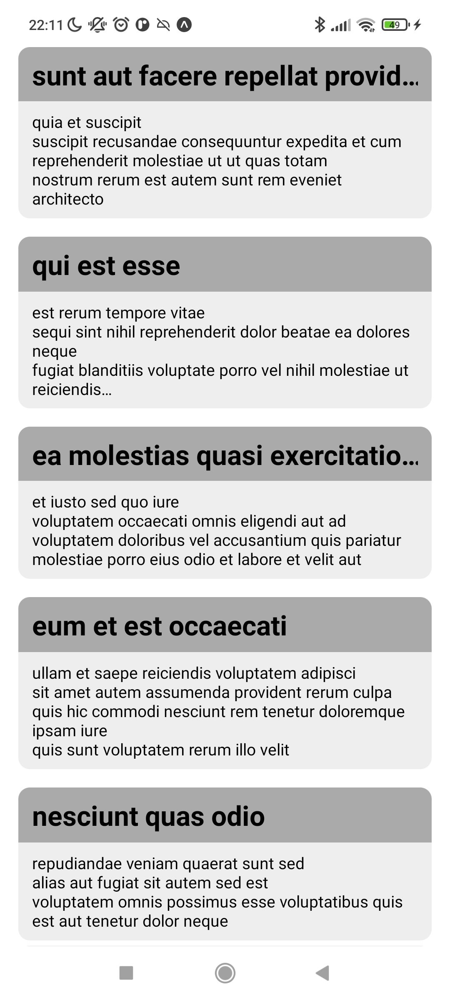
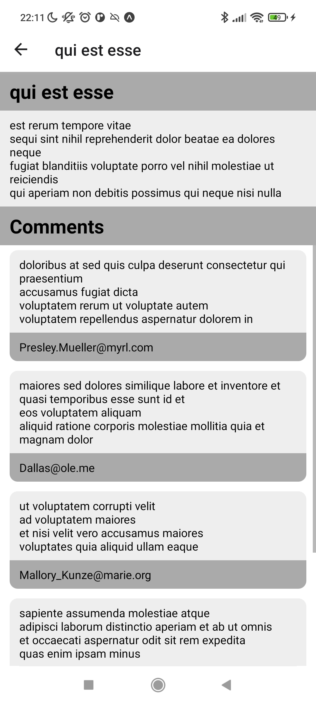

# Interview Exercise

- on the main screen show a list of fetched posts from https://jsonplaceholder.typicode.com/posts (list of available EPs is in the main page: https://jsonplaceholder.typicode.com/)
- onPress on list's element redirects user (it can be modal or new route screen - it's up to you) to full post with comments bellow (fetched lazily)

Posts list | Single Post
--- | ---
  | 